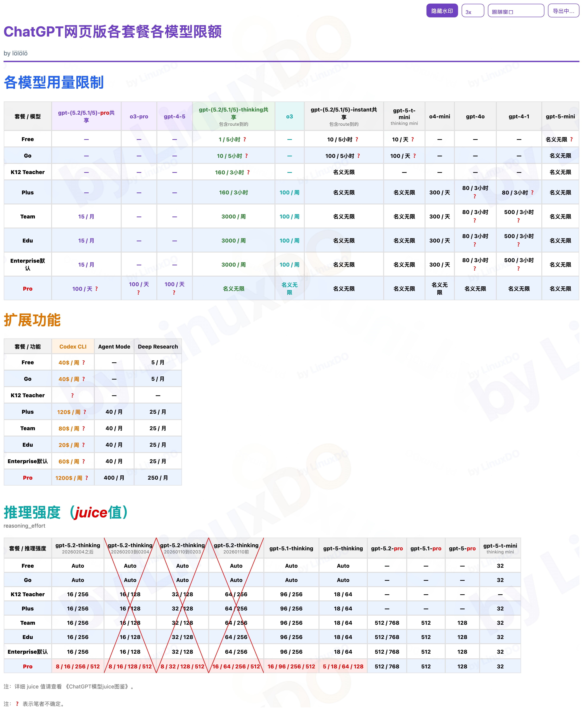
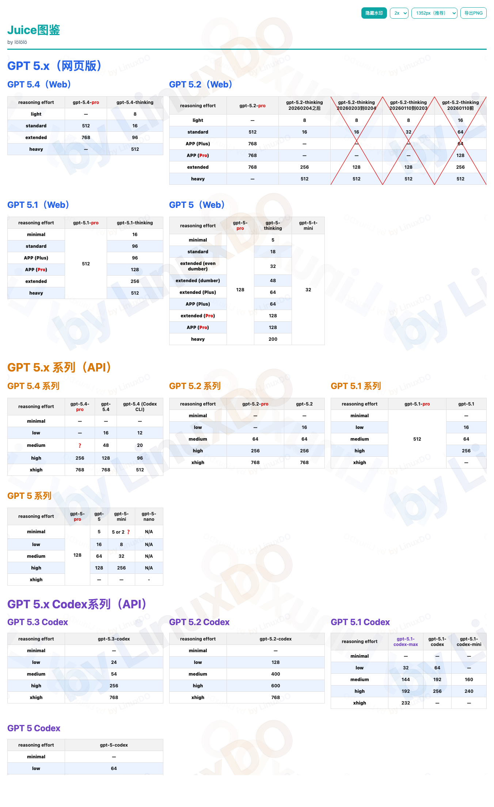
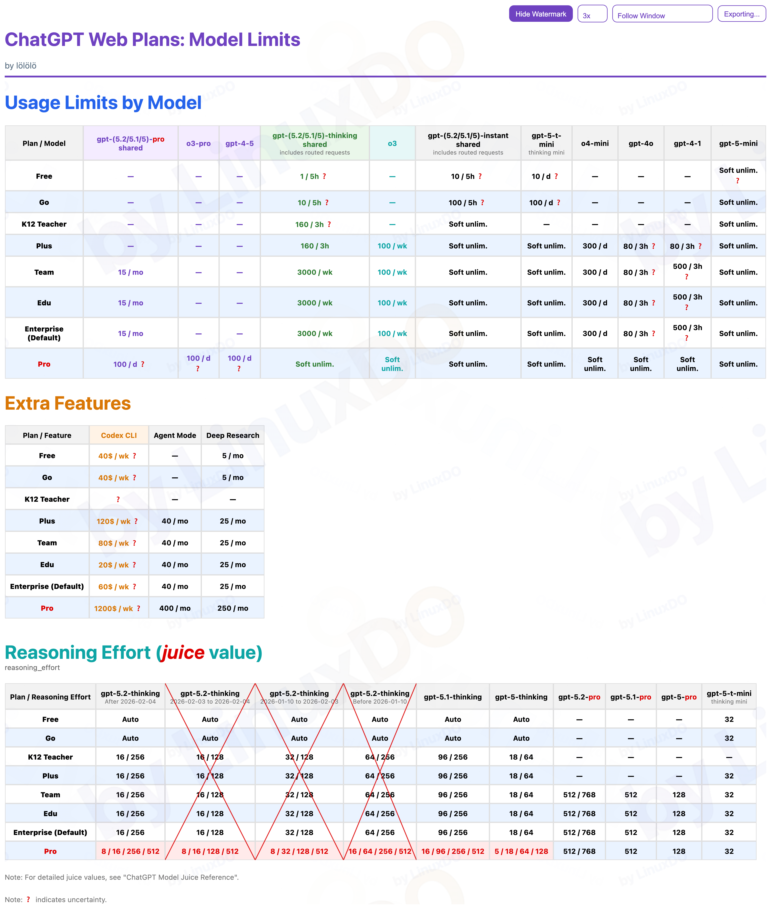

2025.01.16-1

Linux.Do

## 说明

首次发现：[@btibor91](https://x.com/btibor91)  
原始帖子：https://x.com/btibor91/status/1955241562486763962

## Screenshots

### 中文版

#### ChatGPT 网页版各套餐各模型限额

#### ChatGPT 模型 Juice 值图鉴

### English Version

#### ChatGPT Web Plans: Model Limits

#### ChatGPT Model Juice Reference

---

Tips: keep these four filenames fixed under `screenshots/`.  
When you regenerate images, just overwrite the files and README will auto-show latest images.
