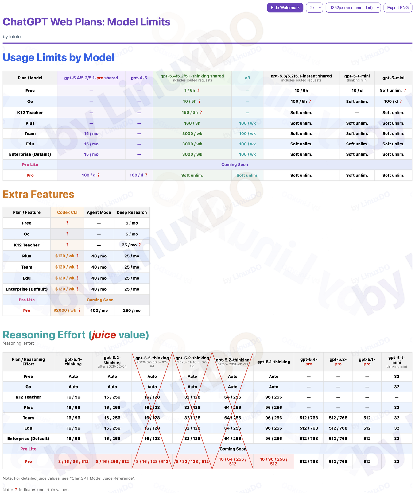
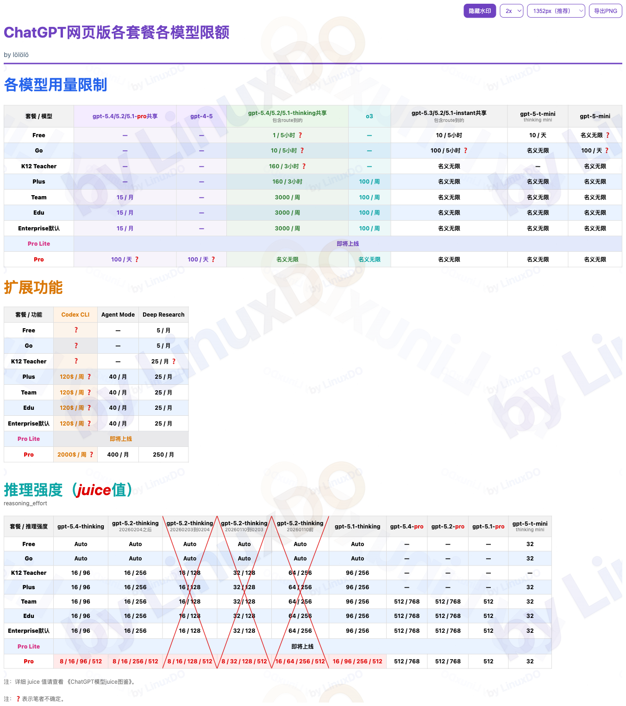

<!--
Maintenance rules for future GPT editors:
1) The first line must use `YYYY.MM.DD-N`.
   - `YYYY.MM.DD` is the commit date.
   - `N` is the Nth submission of that date, decided by the user.
2) The second line must stay as the Linux.Do website link.
-->

2026.02.07-2

[Linux.Do](https://linux.do)

| [English Version](#english-version) | [中文版](#中文版) |
| --- | --- |

## Note

First spotted by: [@btibor91](https://x.com/btibor91)  
Original post: [x.com/btibor91/status/1955241562486763962](https://x.com/btibor91/status/1955241562486763962)

## English Version

### ChatGPT Web Usage: Model Limits

### ChatGPT Model Juice Reference

## 中文版

### ChatGPT 网页版各套餐各模型限额

### ChatGPT 模型 Juice 值图鉴

